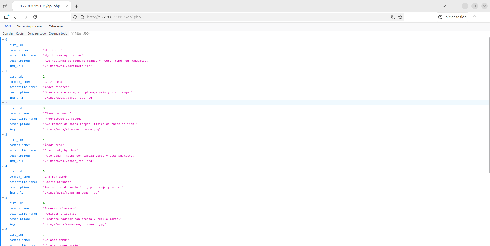
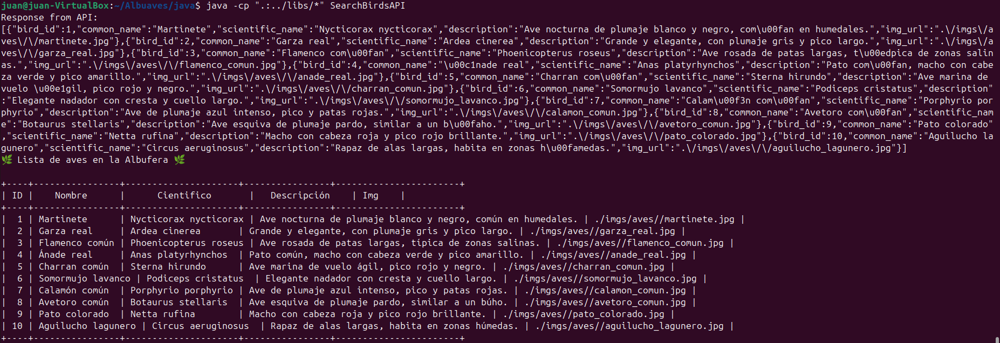

# Albuaves - Arquitectura Cliente-Servidor

Albuaves es un proyecto educativo que implementa una solución completa de software basada en la arquitectura **Cliente-Servidor**. El objetivo es gestionar un catálogo de aves de la Albufera utilizando una API REST y un cliente de escritorio.

## 1. Tecnologías Utilizadas y Motivación

Para el desarrollo de esta solución se han elegido las siguientes tecnologías:

* **Base de Datos:** [SQLite](https://www.sqlite.org/)
    * *Motivación:* Se ha seleccionado SQLite por ser una base de datos ligera, "serverless" (no requiere un proceso servidor dedicado) y portable (es un solo archivo). [cite_start]Es ideal para prototipado rápido y entornos educativos donde la facilidad de configuración es prioritaria.
    * Herramienta de gestión: `sqlitebrowser`.

* **Servidor (Backend):** [PHP](https://www.php.net/)
    * *Motivación:* PHP permite desplegar servidores web de manera nativa y sencilla. Su integración con SQLite es excelente y permite crear endpoints REST JSON con muy pocas líneas de código.

* **Cliente (Frontend):** [Java](https://www.java.com/)
    * *Motivación:* Java es un lenguaje robusto, fuertemente tipado y estándar en la industria para el desarrollo de aplicaciones de escritorio y backend.
    * **Librerías:**
        * `org.json` ([JSON-java](https://github.com/stleary/JSON-java)): Para el parseo de las respuestas del servidor.
        * `sqlite-jdbc`: Controlador para operaciones de base de datos (si fueran necesarias en local).

---

## 2. Manual de Puesta en Marcha (How-To)

[cite_start]A continuación se detallan los pasos para desplegar la infraestructura de desarrollo y pruebas[cite: 48].

### A. Puesta en marcha del Servidor (API)

El proyecto incluye un script de automatización para facilitar el arranque.

1.  Dar permisos de ejecución al script:
    ```bash
    chmod +x run-api-server.sh
    ```
2.  Ejecutar el script desde la raíz del proyecto:
    ```bash
    ./run-api-server.sh
    ```
3.  El servidor quedará escuchando en `http://127.0.0.1:9191`.

**Captura de la API funcionando:**
Aquí se muestra la respuesta JSON en el navegador al consultar `http://127.0.0.1:9191/api.php`:



---

### B. Compilación y Ejecución del Cliente Java

El cliente Java (`SearchBirdsAPI`) se conecta a la API para recuperar la lista de aves y formatearla en una tabla legible.

1.  Acceder al directorio del código fuente:
    ```bash
    cd java
    ```
2.  **Compilar** el código (incluyendo las librerías):
    ```bash
    javac -cp ".:../libs/*" *.java
    ```
3.  **Ejecutar** el cliente:
    ```bash
    java -cp ".:../libs/*" SearchBirdsAPI
    ```

**Captura del Cliente Java:**
A continuación se muestra la ejecución en terminal, donde se observa la respuesta JSON cruda y la tabla formateada:



---

## 3. Autores y Licencia
Proyecto desarrollado para el módulo de Sostenibilidad (DAM).
